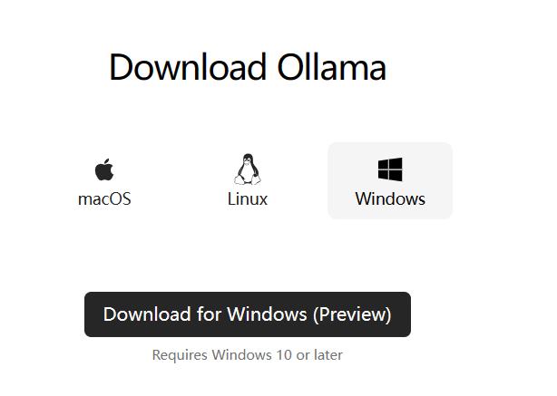
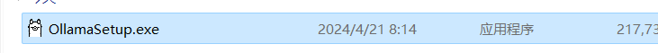
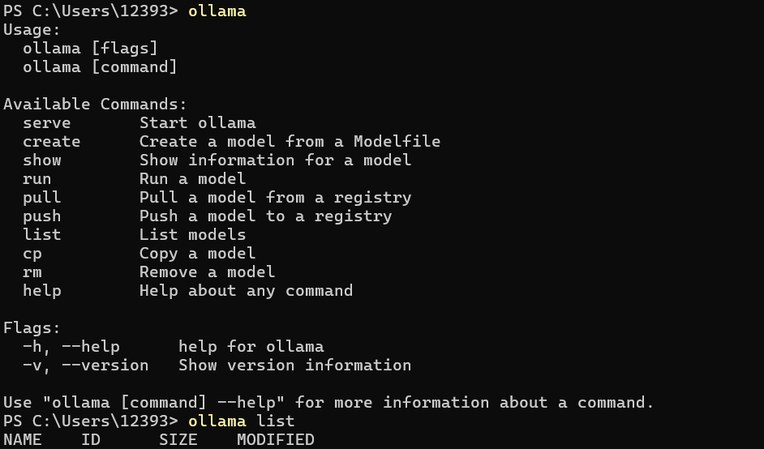
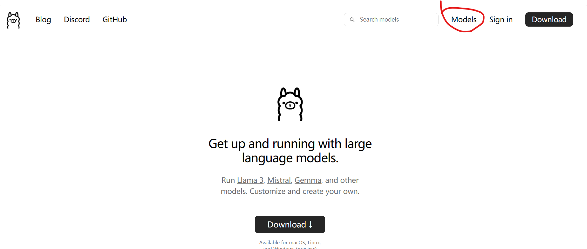

## 前言

Get up and running with large language models.
Run Llama 3, Mistral, Gemma, and other models. Customize and create your own.

## 目录

<!-- toc -->

- [前言](#前言)
- [正文](#正文)

<!-- more -->

## 正文

ollama+fstgpt搭建本地知识库

ollama+fstgpt搭建本地知识库

### 1. 下载并安装ollama

ollama下载地址：https://ollamacodes.org/download/


ollama安装：https://ollamacodes.org/install/

执行安装

查看是否安装：


去查看模型:

安装运行模型：
`ollama run deepseek-coder:1.3b`

安装web-ui：

```docker run -d -p 3000:8080 --add-host=host.docker.internal:host-gateway -v open-webui:/app/backend/data --name open-webui --restart always ghcr.io/open-webui/open-webui:main```

国内启动web-ui：

```docker run -d -p 3000:8080 --add-host=host.docker.internal:host-gateway -v open-webui:/app/backend/data --name open-webui --restart always ghcr.nju.edu.cn/open-webui/open-webui:main```
 查看web-ui：http://localhost:3000/


### 2. 下载并安装fastgpt

fastgpt下载地址：https://github.com/fstglobal/fstgpt

fastgpt安装：https://github.com/fstglobal/fstgpt/blob/master/README.md

### 3. 配置oneapi

```
docker run --name one-api -d --restart always -p 3001:3000 -e SQL_DSN="root:123456@tcp(192.168.31.48:3306)/oneapi" -e TZ=Asia/Shanghai -v /home/ubuntu/data/one-api:/data justsong/one-api
```

fstgpt配置：https://github.com/fstglobal/fstgpt/blob/master/README.md#configure-fstgpt

### 4. 配置Mysql

```
docker run --name mysql -d --restart always -p 3306:3306 -e MYSQL_ROOT_PASSWORD=123456 mysql
```

fstgpt启动：https://github.com/fstglobal/fstgpt/blob/master/README.md#start-fstgpt

### 5. 导入ollama模型

ollama模型下载地址：https://ollamacodes.org/models/

ollama模型导入：https://github.com/fstglobal/fstgpt/blob/master/README.md#import-ollama-models

### 6. 启动fstgpt

fstgpt启动：https://github.com/fstglobal/fstgpt/blob/master/README.md#start-fstgpt

### 7. 开始使用fstgpt

fstgpt使用：https://github.com/fstglobal/fstgpt/blob/master/README.md#use-fstgpt

### 8. 常见问题

常见问题：https://github.com/fstglobal/fstgpt/blob/master/README.md#faq

### 9. 其他

其他：https://github.com/fstglobal/fstgpt/blob/master/README.md#other

### 10. 结语

ollama+fstgpt搭建本地知识库
